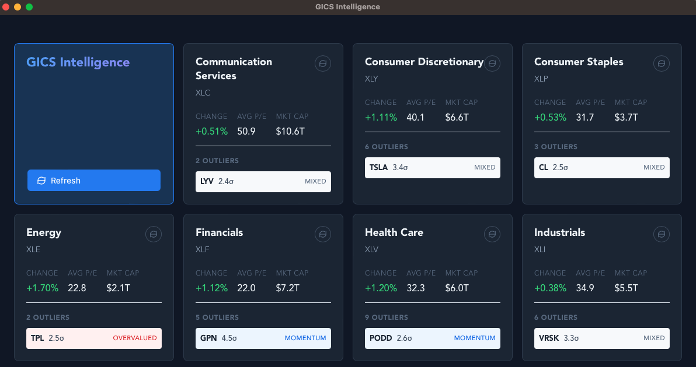
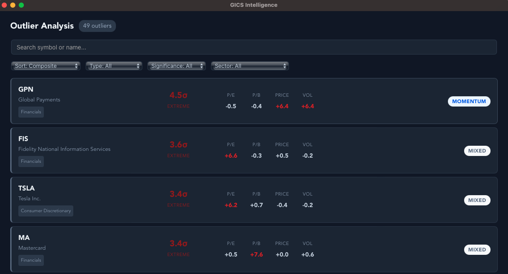

# GICS Intelligence

A macOS desktop app for tracking S&P 500 sector performance and detecting statistical outliers across all 11 GICS sectors. Built with Tauri 2, React 19, and Rust.

## Screenshots





## Features

- **Sector overview** — Live metrics for all 11 GICS sectors (price change, P/E ratio, market cap, beta)
- **Outlier detection** — Z-score analysis to surface undervalued, overvalued, momentum, and other anomalous stocks
- **Real-time refresh** — Fetches market data from Yahoo Finance with progress tracking
- **Local storage** — SQLite database for offline access and historical data
- **Dark mode** — Follows system appearance

## Requirements

| Tool | Version | Install |
|------|---------|---------|
| **Rust** | stable (2021 edition) | [rustup.rs](https://rustup.rs) |
| **Node.js** | 18+ | [nodejs.org](https://nodejs.org) or `brew install node` |
| **npm** | 9+ | Included with Node.js |
| **Xcode CLT** | Latest | `xcode-select --install` |

Tauri 2 also requires macOS system dependencies. If you haven't built a Tauri app before, install the prerequisites:

```sh
xcode-select --install
```

## Getting Started

1. **Clone the repository**

   ```sh
   git clone <repo-url>
   cd sector-view
   ```

2. **Install frontend dependencies**

   ```sh
   npm install
   ```

3. **Run in development mode**

   ```sh
   npm run tauri dev
   ```

   This starts the Vite dev server on `localhost:1420` and launches the Tauri window with hot-reload.

4. **Build for production**

   ```sh
   npm run tauri build
   ```

   The compiled `.app` bundle will be in `src-tauri/target/release/bundle/macos/`.

## Project Structure

```
sector-view/
├── src/                        # React/TypeScript frontend
│   ├── components/             # UI components (SectorGrid, Header, etc.)
│   ├── hooks/                  # useDatabase hook for Tauri commands
│   └── types/                  # TypeScript interfaces
├── src-tauri/                  # Rust backend
│   ├── src/
│   │   ├── commands.rs         # Tauri commands exposed to frontend
│   │   ├── database.rs         # SQLite init and migrations
│   │   ├── market_data.rs      # Yahoo Finance API integration
│   │   ├── outlier_detection.rs# Z-score outlier analysis
│   │   └── stock_discovery.rs  # S&P 500 stock discovery
│   └── migrations/             # SQLite migrations
├── package.json
└── vite.config.ts
```

## Tech Stack

- **Frontend:** React 19, TypeScript 5.8, Vite 7
- **Backend:** Rust, Tauri 2, SQLx (SQLite), Tokio, Reqwest
- **Data:** Yahoo Finance API, local SQLite database
